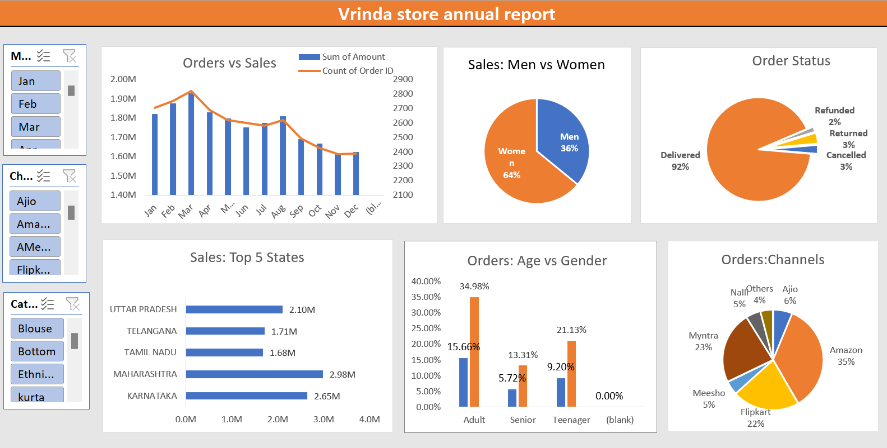

# Vrinda Store Annual Sales Analysis

## Project Overview

This project presents an interactive Annual Sales Analysis Dashboard developed using Microsoft Excel to evaluate Vrinda Store's sales performance, customer demographics, order status, sales channels, and geographic performance.

The dashboard transforms raw sales data into meaningful business insights using KPIs, Pivot Tables, Pivot Charts, and interactive filters.

## Business Objective

The objective of this project is to analyze annual sales performance and understand:

- Overall sales and order trends
- Monthly sales performance
- Sales performance by gender
- Order status and fulfillment performance
- State-wise sales performance
- Customer age and gender distribution
- Sales performance across different channels
- Product/category performance

## Dataset

The project uses the Vrinda Store sales dataset containing order-level information related to customers, products, sales, order status, channels, locations, age groups, and gender.

The dataset was analyzed to identify sales trends, customer segments, geographic performance, and channel contribution.

## Dashboard Preview

## Key Analysis

### 1. Orders vs Sales

Analyzed monthly sales and order volumes to identify changes in sales performance throughout the year.

### 2. Sales: Men vs Women

Compared sales contribution between male and female customers.

### 3. Order Status

Analyzed the distribution of delivered, cancelled, returned, and refunded orders to understand order fulfillment performance.

### 4. Sales by State

Identified the top-performing states based on sales revenue.

### 5. Orders by Age and Gender

Analyzed order contribution across different age groups and genders to understand customer demographics.

### 6. Orders by Channel

Compared sales/order contribution across major sales channels such as Amazon, Myntra, Flipkart, Meesho, Ajio, and others.

### 7. Product and Category Analysis

Analyzed product and category-level performance to identify areas contributing to overall sales.

## Key Insights

- Women contributed a higher share of sales compared with men, accounting for approximately 64% of sales.
- Amazon was the largest sales channel, contributing approximately 35% of orders.
- Maharashtra was the highest-performing state among the top 5 states shown, followed by Karnataka.
- Delivered orders represented approximately 92% of total orders, indicating a high delivery completion rate.
- The Adult customer segment contributed the highest share of orders among the age groups displayed.
- Sales and order volumes varied across months, highlighting seasonal changes in customer demand.
- Major e-commerce channels such as Amazon, Myntra, and Flipkart contributed significantly to overall orders.

## Business Recommendations

- Focus marketing campaigns on the female customer segment due to its higher contribution to sales.
- Strengthen partnerships and promotional campaigns on high-performing sales channels.
- Prioritize high-performing states for targeted marketing and inventory planning.
- Analyze returned, cancelled, and refunded orders to identify opportunities for improving customer experience.
- Use customer age and gender insights to create targeted marketing campaigns.
- Plan seasonal promotions based on monthly sales trends.
- Identify high-performing products and categories and prioritize them during major sales campaigns.

## Tools & Skills

- Microsoft Excel
- Data Cleaning
- Data Analysis
- Pivot Tables
- Pivot Charts
- Data Visualization
- Dashboard Development
- KPI Analysis
- Customer Segmentation
- Sales Analysis
- Business Insights

## Project Files

- `Vrinda_Store_Annual_Report.xlsx` – Excel dashboard and analysis
- `Vrinda_Store_Annual_Report.png` – Dashboard preview
- `README.md` – Project overview, analysis, insights, and recommendations

## Conclusion

The Vrinda Store Annual Sales Analysis Dashboard provides a consolidated view of sales performance, customer demographics, order fulfillment, geographic contribution, and sales channels.

The analysis demonstrates how Excel can be used to transform raw sales data into interactive visualizations and actionable business insights that can support marketing, sales, inventory, and customer strategy decisions.
